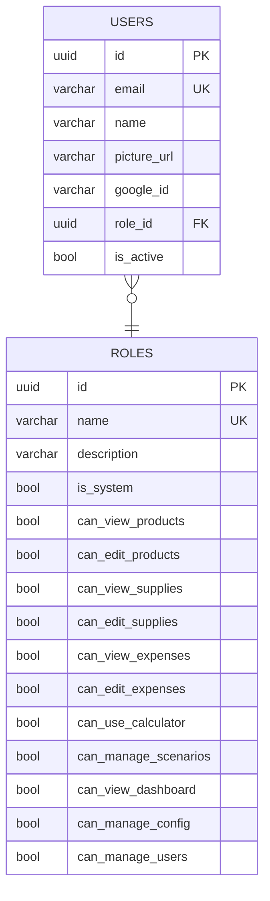
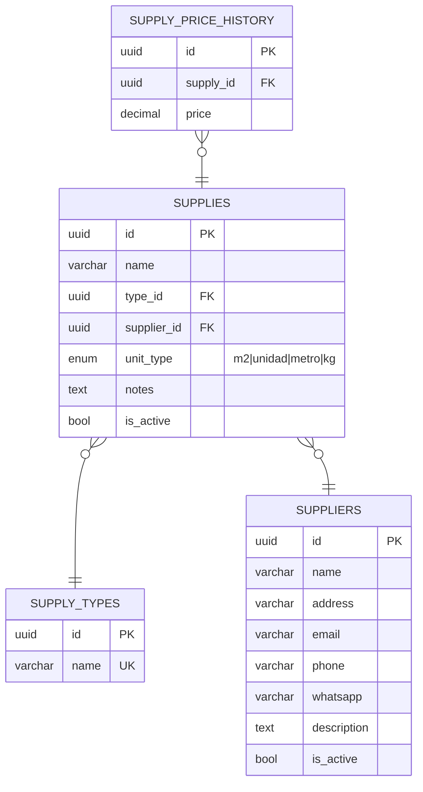
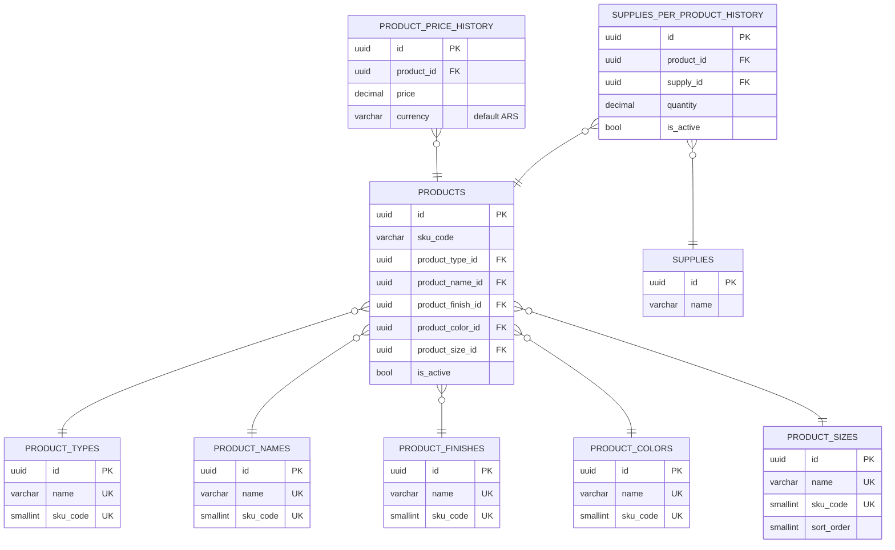
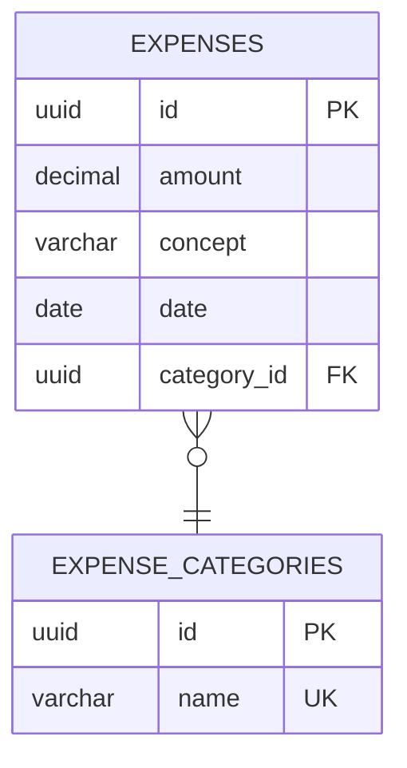
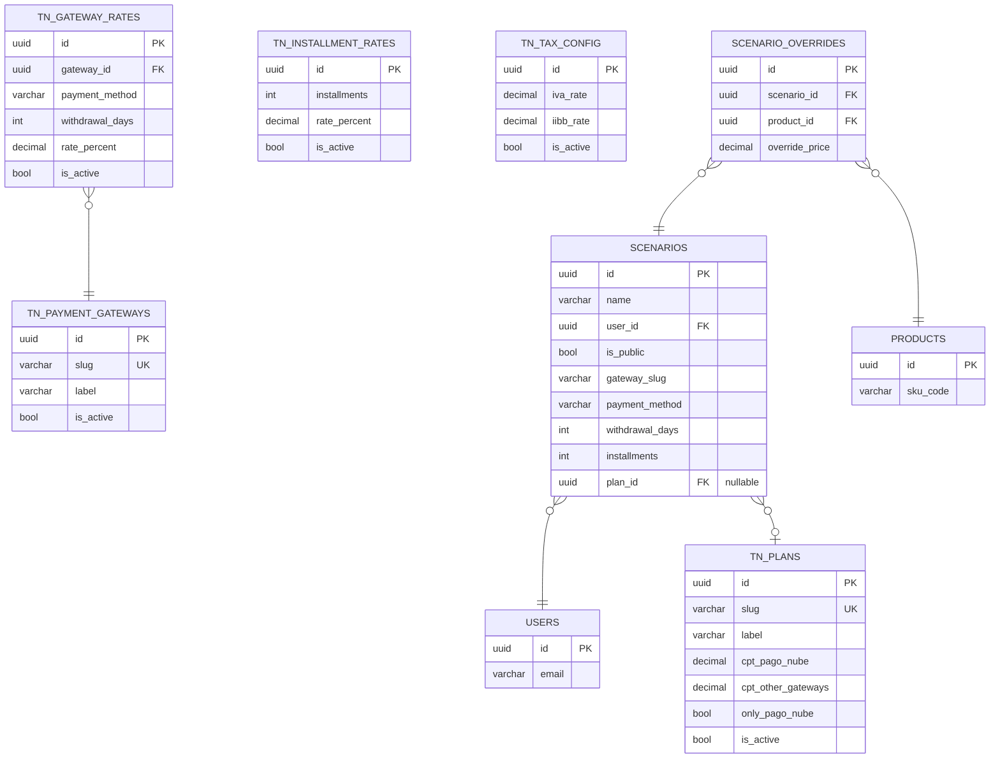

# Nemea

App web de gestión y pricing para **Nemea** — emprendimiento de marroquinería en cuero. Reemplaza el Google Sheets que se usaba para insumos, productos, costos, gastos y la calculadora de pricing de Tiendanube. Incluye dashboard de inversores y escenarios de simulación de precios.

> Monorepo orquestador con dos sub-proyectos independientes (`nemea-front` + `nemea-back`).

---

## Stack

| Capa | Tecnología |
|------|------------|
| **Frontend** | Next.js 16 (App Router) · TypeScript · Tailwind v4 · Shadcn/ui · NextAuth |
| **Backend** | NestJS · TypeScript · TypeORM · JWT |
| **DB** | PostgreSQL (Railway) |
| **Hosting** | Vercel (front) · Railway (back + DB) |
| **Auth** | NextAuth (front) + JWT (back) — múltiples usuarios con roles dinámicos |

---

## Arquitectura

```
┌──────────┐      ┌──────────────────┐      ┌─────────────────┐      ┌────────────────┐
│  Usuario │ ───► │  nemea-front     │ ───► │  nemea-back     │ ───► │  PostgreSQL    │
│ (browser)│      │  Next.js · :3000 │      │  NestJS · :4000 │      │  Railway       │
└──────────┘      │  Vercel          │      │  Railway        │      └────────────────┘
                  └──────────────────┘      └─────────────────┘
                       NextAuth                  JWT + RBAC
```

- **Frontend** sirve UI + auth (Google OAuth via NextAuth) y llama al backend con el JWT.
- **Backend** expone REST, valida con guards (roles + permisos), y persiste vía TypeORM.
- **DB** centraliza todo: catálogos, productos, costos, historial de precios, configuración Tiendanube y escenarios.

---

## Sub-proyectos

| Proyecto | Carpeta | Stack | Puerto | Branch model |
|----------|---------|-------|--------|--------------|
| Frontend | `nemea-front/` | Next.js + TS + Tailwind v4 + Shadcn/ui | 3000 | `development` → `main` |
| Backend  | `nemea-back/`  | NestJS + TS + PostgreSQL + TypeORM     | 4000 | `development` → `main` |
| Root     | `./`           | Orquestador (este repo)                | —    | direct `main` |

Cada sub-repo tiene su propio README con detalles específicos de setup, scripts y deploy.

---

## Modelo de datos

> Generado a partir de las entities TypeORM en `nemea-back/src/**/*.entity.ts`.
> Todas las entidades extienden `BaseEntity` → `id: uuid PK`, `created_at: timestamptz`, `updated_at: timestamptz` (omitidos en los diagramas para que se vean limpios).
>
> Se divide en 5 dominios. Cada diagrama es independiente y autocontenido.

### 1. Auth & RBAC

Usuarios con login por Google y roles dinámicos con permisos granulares.



### 2. Suppliers & Supplies

Proveedores, insumos (cuero, herrajes, packaging) con tipo y unidad, e historial inmutable de precios.



### 3. Products Catalog

Productos con SKU compuesto por 5 ejes (type · name · finish · color · size), historial de precios e historial de BOM (insumos por producto).



> `SUPPLIES` aparece como stub para mostrar la relación de la BOM. Su definición completa está en el diagrama (2).

### 4. Expenses

Gastos con categoría. Simple, sin historial — se versiona con `updated_at`.



### 5. Tiendanube Config & Scenarios

Configuración de planes, gateways, cuotas e impuestos para la calculadora de pricing. Los escenarios permiten guardar combinaciones y sobreescribir precios de productos puntuales sin tocar el catálogo real.



> `USERS` y `PRODUCTS` aparecen como stubs para mostrar las relaciones cruzadas.

### Notas de modelado

- **UUIDs en todas las entidades** (`@PrimaryGeneratedColumn('uuid')`).
- **Roles dinámicos con permisos granulares**: cada permiso es un boolean en `roles`. Los roles `is_system = true` no se pueden borrar.
- **SKU compuesto** en `products`: se arma con los `sku_code` de los 5 catálogos (type · name · finish · color · size).
- **Historial inmutable** (`*_price_history`, `supplies_per_product_history`): nunca se updatea, se insertan nuevas filas. El precio/BOM "actual" es la fila más reciente. `ON DELETE CASCADE` desde el producto/insumo padre.
- **Scenarios** permiten simular pricing alternativo (gateway, plan, cuotas) y sobreescribir precios de productos específicos sin tocar el catálogo real.
- **Tiendanube config** está desnormalizada en varias tablas para soportar combinaciones de plan × gateway × medio de pago × cuotas × días de retiro.

---

## Quickstart

```bash
# Frontend
cd nemea-front
npm install
npm run dev          # http://localhost:3000

# Backend (en otra terminal)
cd nemea-back
npm install
npm run start:dev    # http://localhost:4000
```

> Variables de entorno en cada sub-repo (`.env.example`). Para DB local usar PostgreSQL o apuntar al Railway dev.

---

## Comandos del orquestador

| Comando | Acción |
|---------|--------|
| `/run`  | Levantar dev servers (front, back, o ambos) |
| `/stop` | Parar dev servers |
| `/commit` | Commit local: `/commit f`, `/commit b "msg"`, `/commit w` |
| `/push` | Push + PR: `/push f d` (front→dev), `/push b p` (back→prod) |
| `/plan` | Gestionar planes de implementación |
| `/senior` | Senior code reviewer (review, chat, audit, premortem) |

---

## Estructura del repo

```
Nemea-web/
├── nemea-front/          # Next.js app
├── nemea-back/           # NestJS API
├── calculadora/          # Prototipo original de la calculadora (referencia)
├── .planning/            # GSD: PROJECT, ROADMAP, STATE, fases, research
├── .claude/              # Agentes, commands, docs internos
└── CLAUDE.md             # Orquestador raíz (convenciones del monorepo)
```

---

## Roadmap

- **v1.0** — ✅ Reemplazo de Google Sheets: ABM insumos/precios, productos/costos, gastos, auth.
- **v1.1** — 🚧 Hardening, UX de productos, config Tiendanube, calculadora integrada, dashboard de inversores.
- **v2+** — Integración API Tiendanube (ventas reales), clientes B2B, órdenes, solicitudes de compra a talleres.

Detalle completo en [`.planning/ROADMAP.md`](.planning/ROADMAP.md).
